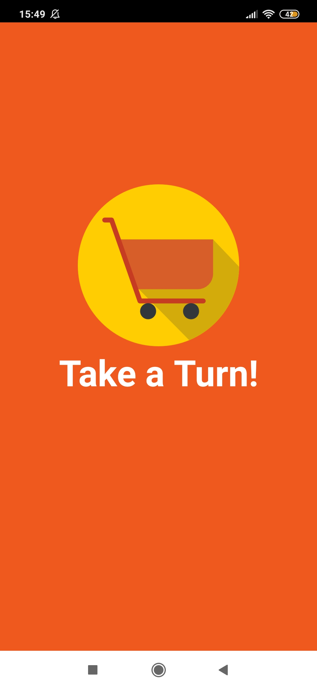
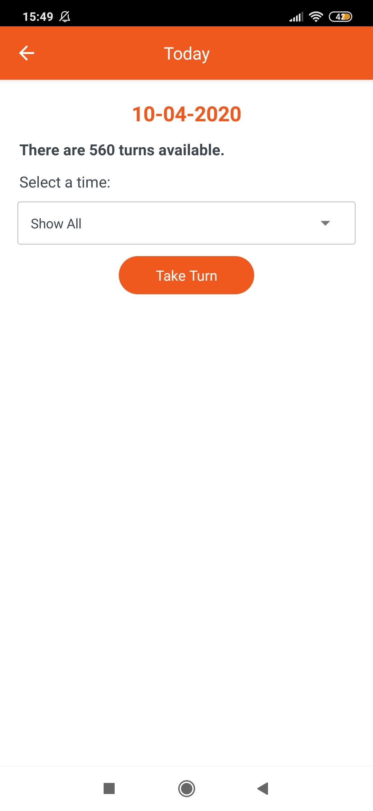
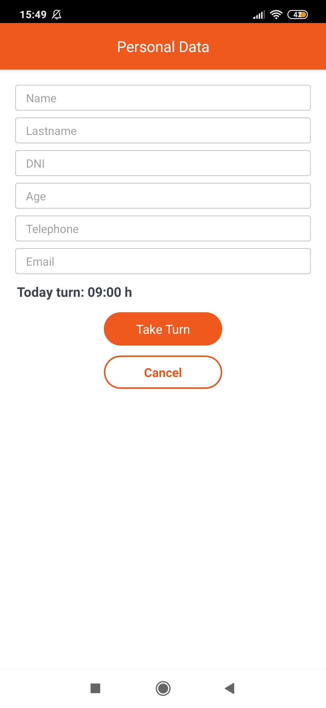

# mat|r Take a Turn App
Data and code of Take a Turn App, a mobile application related with COVID-19 that I developed with [mat|r script](https://www.matrproject.com/) for Android and iOS devices.

This is an app for use by supermarkets during the COVID-19 pandemic to prevent large numbers of people from gathering in supermarkets and to avoid long lines of people waiting to get in. A rigid structure was adopted, assuming 20 people per shift, with durations of 20 min each from 9 to 18 h. This can be modified to suit requirements.

**Programming Language:** mat|r script

**Author:** Agustina Dinamarca (agustinadinamarca@gmail.com)

